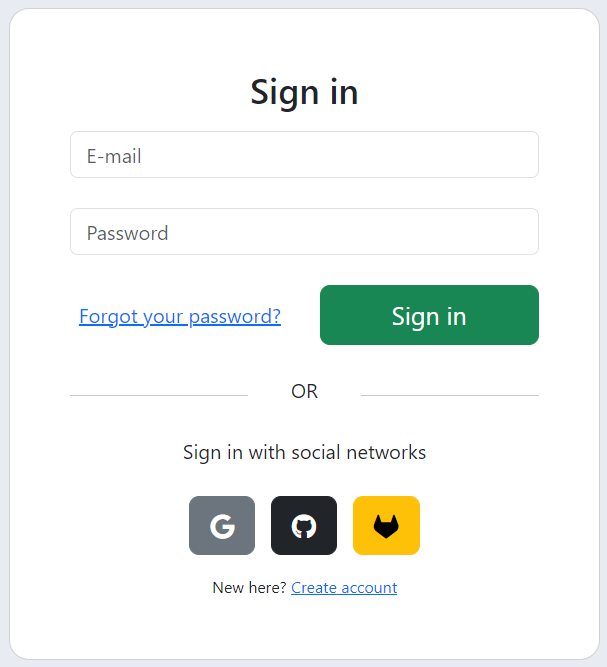
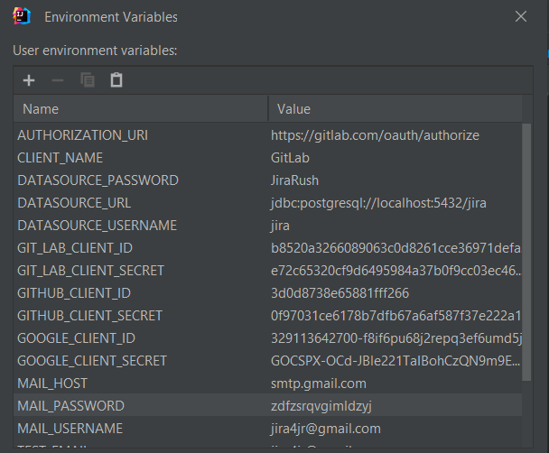
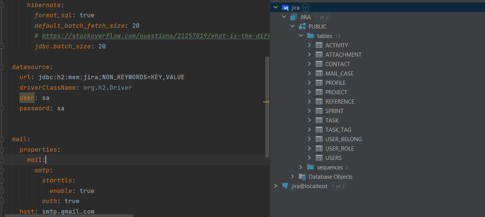
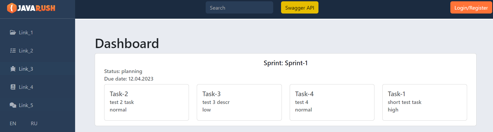
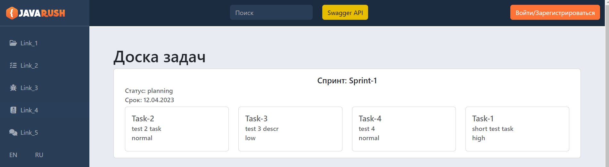
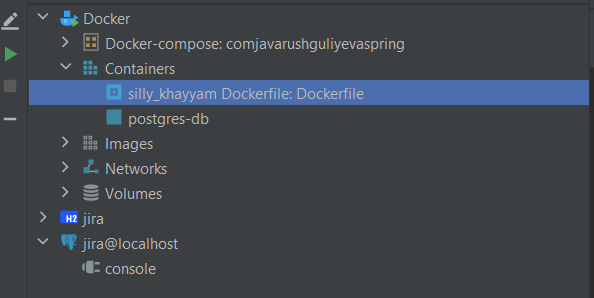

## [REST API](http://localhost:8080/doc)

## Концепция:
- Spring Modulith
  - [Spring Modulith: достигли ли мы зрелости модульности](https://habr.com/ru/post/701984/)
  - [Introducing Spring Modulith](https://spring.io/blog/2022/10/21/introducing-spring-modulith)
  - [Spring Modulith - Reference documentation](https://docs.spring.io/spring-modulith/docs/current-SNAPSHOT/reference/html/)

```
  url: jdbc:postgresql://localhost:5432/jira
  username: jira
  password: JiraRush
```
- Есть 2 общие таблицы, на которых не fk
  - _Reference_ - справочник. Связь делаем по _code_ (по id нельзя, тк id привязано к окружению-конкретной базе)
  - _UserBelong_ - привязка юзеров с типом (owner, lead, ...) к объекту (таска, проект, спринт, ...). FK вручную будем проверять

## Аналоги
- https://java-source.net/open-source/issue-trackers

## Тестирование
- https://habr.com/ru/articles/259055/

Список выполненных задач:
...
+ Удалить социальные сети: vk, yandex.
+ 
+ Вынести чувствительную информацию (логин, пароль БД, идентификаторы для OAuth регистрации/авторизации, настройки почты) в отдельный проперти файл. Значения этих проперти должны считываться при старте сервера из переменных окружения машины.
+ 
+ Переделать тесты так, чтоб во время тестов использовалась in memory БД (H2), а не PostgreSQL. Для этого нужно определить 2 бина, и выборка какой из них использовать должно определяться активным профилем Spring. 
+ 
+ Написать тесты для всех публичных методов контроллера ProfileRestController.
+ 
+ Добавить новый функционал: добавления тегов к задаче. Фронт делать необязательно.
+ Добавить возможность подписываться на задачи, которые не назначены на текущего пользователя. (Рассылку уведомлений/письма о смене статуса задачи делать не нужно). Фронт делать необязательно.
+ Добавить локализацию минимум на двух языках для шаблонов писем и стартовой страницы index.html.
+ 
+ 
+ Написать Dockerfile для основного сервера
+ 
